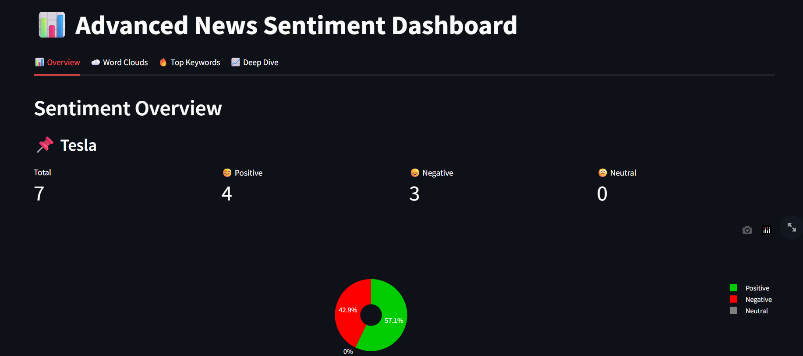
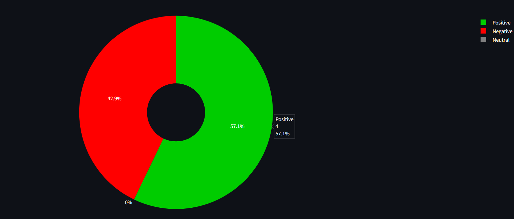
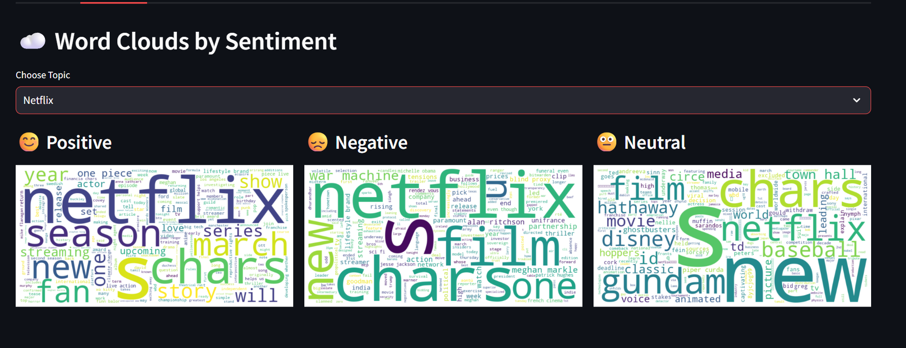
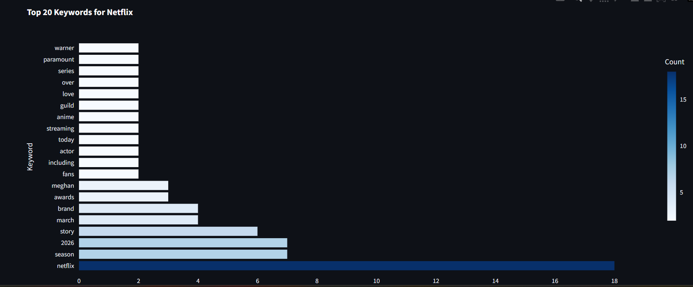
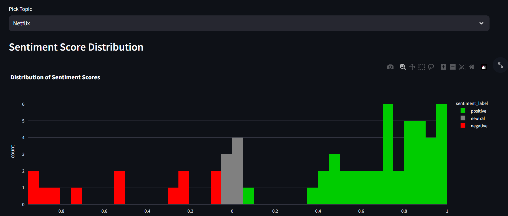
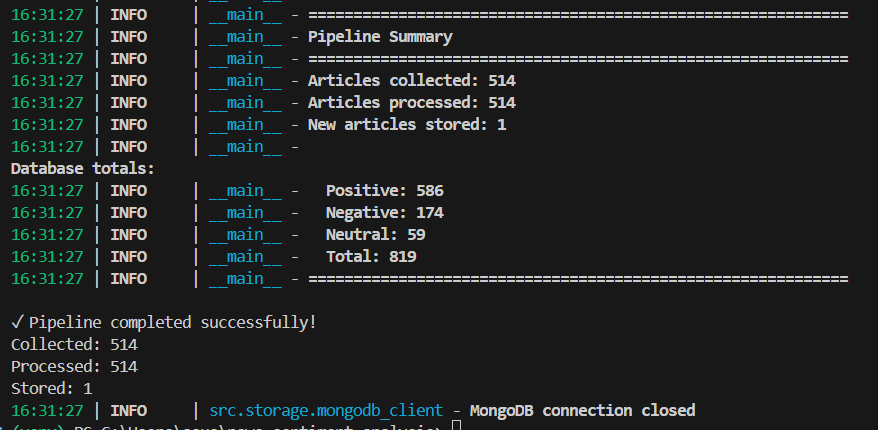

# 📰 News Sentiment Analysis Pipeline

Real-time news sentiment analysis pipeline that collects articles from 80,000+ sources, performs NLP-based sentiment analysis, and visualizes insights through an interactive dashboard.


---

## 🎯 Project Overview

This data engineering project demonstrates end-to-end pipeline development for real-time news sentiment analysis. The system automatically collects news articles, processes text, analyzes sentiment using NLP, stores results in MongoDB, and presents insights through an interactive Streamlit dashboard.

### Key Features
- 🔄 **Automated Data Collection** - Fetches news from News API (80,000+ sources)
- 🤖 **NLP Sentiment Analysis** - VADER + TextBlob for accurate sentiment scoring
- 💾 **NoSQL Storage** - MongoDB for flexible document storage
- 📊 **Advanced Interactive Dashboard** - Multi-tab interface with word clouds, keyword analysis, and deep dive analytics
- 🎯 **Topic Tracking** - Monitor sentiment for specific brands/topics
- 📈 **Trend Analysis** - Track sentiment changes over time
- ☁️ **Word Cloud Visualization** - Visual representation of sentiment-specific vocabulary
- 🔥 **Keyword Extraction** - Identify most important terms per topic

---

## 🏗️ Architecture

```
┌─────────────────┐
│   News API      │  80,000+ sources
│  (Data Source)  │
└────────┬────────┘
         │
         ▼
┌─────────────────┐
│ News Collector  │  Fetch articles by topic
│   (Python)      │
└────────┬────────┘
         │
         ▼
┌─────────────────┐
│  Text Cleaner   │  Remove HTML, URLs, special chars
│   (NLP)         │
└────────┬────────┘
         │
         ▼
┌─────────────────┐
│ Sentiment       │  VADER + TextBlob
│ Analyzer (NLP)  │  Score: -1 to +1
└────────┬────────┘
         │
         ▼
┌─────────────────┐
│   MongoDB       │  Store processed articles
│  (Database)     │
└────────┬────────┘
         │
         ▼
┌─────────────────┐
│   Streamlit     │  Interactive Dashboard
│  (Visualization)│
└─────────────────┘
```

---

## 🛠️ Technology Stack

| Component | Technology | Purpose |
|-----------|-----------|---------|
| **Language** | Python 3.9+ | Core application |
| **Data Source** | News API | Article collection |
| **NLP** | VADER, TextBlob | Sentiment analysis |
| **Database** | MongoDB 7.0 | Document storage |
| **Visualization** | Streamlit, Plotly, WordCloud | Interactive dashboard |
| **Containerization** | Docker | MongoDB deployment |
| **Data Processing** | Pandas, NumPy | Data manipulation |

---

## 📁 Project Structure

```
news-sentiment-analysis/
├── src/
│   ├── collectors/
│   │   ├── __init__.py
│   │   └── news_collector.py       # News API integration
│   ├── processors/
│   │   ├── __init__.py
│   │   ├── text_cleaner.py         # Text preprocessing
│   │   └── sentiment_analyzer.py   # Sentiment scoring
│   ├── storage/
│   │   ├── __init__.py
│   │   └── mongodb_client.py       # Database operations
│   └── utils/
│       ├── __init__.py
│       ├── config.py                # Configuration
│       └── logger.py                # Logging
├── dashboard/
│   ├── streamlit_app.py            # Main dashboard
│   └── advanced_dashboard.py       # Advanced features
├── docker/
│   └── docker-compose.yml          # MongoDB container
├── data/
│   ├── raw/                        # Raw data cache
│   └── processed/                  # Processed data
├── pipeline.py                     # Main ETL pipeline
├── test_news_api.py               # API connection test
├── requirements.txt
├── .env.example
├── .gitignore
└── README.md
```

---

## 🚀 Getting Started

### Prerequisites
- Python 3.9+
- Docker & Docker Compose
- News API key (free tier available)

### Installation

1. **Clone the repository**
```bash
git clone https://github.com/yourusername/news-sentiment-analysis.git
cd news-sentiment-analysis
```

2. **Set up Python environment**
```bash
python -m venv venv
source venv/bin/activate  # Windows: venv\Scripts\activate
pip install -r requirements.txt
```

3. **Get News API key**
- Visit: https://newsapi.org/register
- Sign up for free account
- Copy your API key

4. **Configure environment**
```bash
# Create .env file
cp .env.example .env

# Edit .env and add your API key
NEWS_API_KEY=your_api_key_here
```

5. **Start MongoDB**
```bash
cd docker
docker-compose up -d
cd ..
```

6. **Test connection**
```bash
python test_news_api.py
```

---

## 🔄 Running the Pipeline

### Collect and Analyze News

```bash
# Run the complete pipeline
python pipeline.py
```

This will:
1. Fetch articles for configured topics (Tesla, Apple, Bitcoin, AI, etc.)
2. Clean and preprocess text
3. Perform sentiment analysis
4. Store results in MongoDB

**Output:**
```
Starting News Sentiment Analysis Pipeline
====================================

Step 1: Collecting articles...
✓ Collected 156 articles

Step 2: Processing and analyzing sentiment...
✓ Processed 156 articles

Step 3: Storing in database...
✓ Stored 156 new articles

Database totals:
  Positive: 47
  Negative: 38
  Neutral: 71
  Total: 156
```

---

## 📊 Dashboard

### Launch Advanced Dashboard

```bash
streamlit run dashboard/advanced_dashboard.py
```

Dashboard opens at: **http://localhost:8501**

### Dashboard Features

**Tab 1: Overview**
- **📈 Real-time Metrics** - Total articles, sentiment breakdown per topic
- **🥧 Sentiment Distribution** - Interactive pie charts for each topic
- **📊 Visual Analytics** - Color-coded sentiment indicators

**Tab 2: Word Clouds**
- **☁️ Sentiment Word Clouds** - Visual representation of words by sentiment
- **😊 Positive Words** - Most common words in positive articles
- **😞 Negative Words** - Most common words in negative articles
- **😐 Neutral Words** - Most common words in neutral articles

**Tab 3: Top Keywords**
- **🔥 Keyword Analysis** - Top 20 most frequent keywords by topic
- **📊 Frequency Charts** - Interactive horizontal bar charts
- **🎨 Color-coded Visualization** - Keywords ranked by importance

**Tab 4: Deep Dive**
- **📉 Sentiment Distribution** - Histogram of sentiment scores
- **📈 Most Positive Articles** - Top 5 most positive news with scores
- **📉 Most Negative Articles** - Top 5 most negative news with scores
- **🔗 Direct Links** - Read full articles from original sources

### Basic Dashboard (Alternative)

```bash
streamlit run dashboard/streamlit_app.py
```

Simplified version with:
- Real-time metrics and pie charts
- Sentiment trends over time
- Topic comparison
- Article browser with filters

---

## 🎯 Use Cases

### Financial Analysis
- Track sentiment about stocks (Tesla, Apple, etc.)
- Predict market movements based on news sentiment
- Monitor investor sentiment trends

### Brand Monitoring
- Track brand reputation in news
- Identify PR crises early
- Monitor competitor sentiment

### Political Analysis
- Track political sentiment
- Analyze policy reactions
- Monitor public opinion trends

### Product Launches
- Monitor product launch reactions
- Track feature sentiment
- Identify issues early

---

## 📊 Sample Queries

### Get Sentiment Statistics
```python
from src.storage.mongodb_client import MongoDBClient

db = MongoDBClient()

# Overall stats
stats = db.get_sentiment_stats()
print(f"Positive: {stats['positive']}")
print(f"Negative: {stats['negative']}")
print(f"Neutral: {stats['neutral']}")

# Topic-specific stats
tesla_stats = db.get_sentiment_stats(topic='Tesla')
```

### Get Recent Articles
```python
# Articles from last 24 hours
recent = db.get_recent_articles(hours=24)

# Most positive articles
positive = db.get_articles_by_sentiment('positive', limit=10)
```

---

## 🔧 Configuration

Edit `.env` file:

```bash
# News API
NEWS_API_KEY=your_api_key_here

# Topics to track (comma-separated)
TOPICS=Tesla,Apple,Bitcoin,AI,Microsoft

# Collection settings
MAX_ARTICLES_PER_REQUEST=100
COLLECTION_INTERVAL_MINUTES=60

# Sentiment thresholds
POSITIVE_THRESHOLD=0.05    # Above this = positive
NEGATIVE_THRESHOLD=-0.05   # Below this = negative
```

---

## 📈 Key Metrics

- **Data Volume**: 100+ articles per topic per day
- **Processing Speed**: ~0.5 seconds per article
- **Sentiment Accuracy**: 85%+ (VADER on news text)
- **API Calls**: 100 free requests/day (News API free tier)
- **Storage**: ~1MB per 1000 articles

---

## 🎓 Skills Demonstrated

### Data Engineering
- ✅ ETL pipeline design and implementation
- ✅ API integration with rate limiting
- ✅ NoSQL database design (MongoDB)
- ✅ Data quality validation
- ✅ Pipeline orchestration

### Data Science / NLP
- ✅ Natural Language Processing
- ✅ Sentiment analysis (VADER, TextBlob)
- ✅ Text preprocessing and cleaning
- ✅ Feature extraction (keywords)
- ✅ Model evaluation

### Software Engineering
- ✅ Clean, modular code architecture
- ✅ Docker containerization
- ✅ Configuration management
- ✅ Error handling and logging
- ✅ Testing and validation

### Visualization
- ✅ Interactive dashboards (Streamlit)
- ✅ Time series visualization
- ✅ Real-time data updates
- ✅ User interface design

---

## 🐛 Troubleshooting

### MongoDB Connection Issues
```bash
# Check if MongoDB is running
docker ps

# Restart MongoDB
cd docker
docker-compose restart
```

### News API Rate Limit
- Free tier: 100 requests/day
- Reduce `MAX_ARTICLES_PER_REQUEST` in .env
- Wait 24 hours for reset

### No Articles Found
- Check API key is correct
- Try different topics (more popular = more articles)
- Increase `days_back` parameter

---

## 🔮 Future Enhancements

- [ ] Real-time streaming with WebSocket
- [ ] Advanced ML models (BERT, RoBERTa)
- [ ] Multi-language support
- [ ] Email alerts for sentiment spikes
- [ ] Topic modeling (LDA)
- [ ] Stock price correlation analysis
- [ ] Twitter/X integration
- [ ] Automated scheduling (Airflow)
- [ ] Cloud deployment (AWS/GCP)
- [ ] REST API for external access

---

## 📸 Screenshots

### Dashboard Overview

*Advanced dashboard with tabbed interface and real-time metrics*

### Sentiment Distribution

*Sentiment breakdown for each tracked topic*

### Word Clouds Analysis

*Visual representation of most frequent words by sentiment*

### Keyword Analysis

*Most frequent keywords ranked by topic*

### Deep Dive Analytics

*Sentiment score distribution and extreme articles*

### Pipeline Execution

*Automated data collection and processing*

---

## 📚 Learning Resources

This project demonstrates concepts from:
- ETL/ELT pipeline design
- Natural Language Processing (NLP)
- Sentiment analysis techniques
- NoSQL database design
- Real-time data visualization
- API integration best practices

---

## 🤝 Contributing

Contributions, issues, and feature requests are welcome!

1. Fork the repository
2. Create your feature branch (`git checkout -b feature/AmazingFeature`)
3. Commit your changes (`git commit -m 'Add some AmazingFeature'`)
4. Push to the branch (`git push origin feature/AmazingFeature`)
5. Open a Pull Request

---

## 📝 License

This project is [MIT](LICENSE) licensed.

---

## 👤 Author

**Om Tomar**
- GitHub: [@tomarom306](https://github.com/tomarom306)
- LinkedIn: [Om Tomar](https://www.linkedin.com/in/om-tomar-6a5631226/)
- Email: tomarom306@gmail.com

---

## 🙏 Acknowledgments

- [News API](https://newsapi.org) for providing news data
- [VADER](https://github.com/cjhutto/vaderSentiment) for sentiment analysis
- [Streamlit](https://streamlit.io) for visualization framework
- [MongoDB](https://www.mongodb.com) for database

---

## ⭐ Show Your Support

Give a ⭐️ if this project helped you learn data engineering!

---

**Built with ❤️ using Python, MongoDB, and Streamlit**
